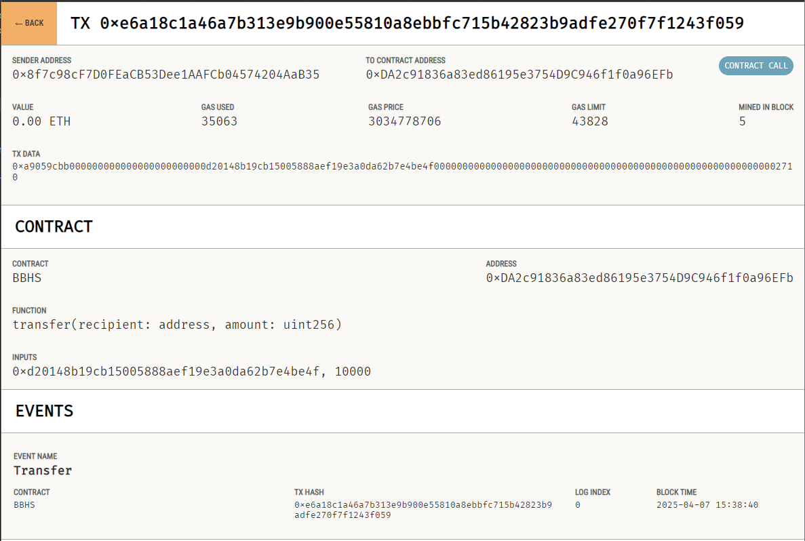

## Blood Bonds Token

### Описание
Blood Bonds — это внутриигровая валюта, предназначенная для использования в игровом процессе. Она служит основным средством обмена, предоставляя игрокам доступ к уникальным возможностям, эксклюзивным предметам и функционалу.

### Запуск
Задеплоить контракт truffle migrate --network development
Скопировать адрес контракта в .env и в constants.js. Так же при первом запуске скопировать адрес разработчика из ganache(первый кошелек) и приватный ключ разработчика
Для запуска фронта открыть файл MainWindow в браузере
Подключить Metamask. В нем добавить тестовую сеть Ganache и подключить какой-нибудь аккаунт из Ganache(не первый)
Запустить бэк node server.js 

### Краткое описание структуры проекта
Проект делится на 3 части - бэкенд, фронтенд и сам смарт контракт.
Бэкенд находится в файле server.js и содержит в себе в основном методы перевода токенов с аккаунта разработчиков
Фронтенд находится в файле MainWindow и представляет из себя верстку, методы работы с клиентским кошельком и ИИ модуль.
Смарт контракт находится в файле BBHS.sol и содержит методы работы с токенами, выполняющиеся децентрализованно.
constsnts.js содержит константы для работы фронта

1_BBHS_migration.js - Файл для миграции смарт контракта и закидывания на него 0.1 eth для оплаты комиссии транзукций.
truffle-config.js - Файл конфигурации смарт контракта

### Полезность токена
1. Эксклюзивные предметы и улучшения
Использование Blood Bonds позволяет игрокам приобретать уникальные игровые предметы, улучшения и скины, недоступные за обычную игровую валюту. Это позволяет выделиться среди других игроков и улучшить игровой процесс.

2. Доступ к дополнительному контенту
Blood Bonds могут быть использованы для открытия дополнительного контента, такого как новые уровни, миссии или другие возможности, которые недоступны без этой валюты. Это позволяет игрокам расширять свои горизонты и получать доступ к новым игровым возможностям.

3. Обмен и торговля
Игроки могут обменивать Blood Bonds с другими пользователями, что открывает возможности для торговли и создания экономики внутри игрового мира.

4. Поддержка разработчиков
Применение Blood Bonds помогает поддерживать развитие игры, так как часть средств от покупки этих токенов может быть направлена на улучшение и расширение контента, что приносит дополнительные возможности для игроков.

### Заключение
Blood Bonds не только делают игровой процесс более захватывающим, но и дают игрокам возможность выделяться среди других участников игры, открывать новый контент и получать доступ к эксклюзивному контенту. Это ценная валюта, которая улучшает взаимодействие внутри игрового мира и способствует созданию богатой и динамичной экономики.

## Скрин транзакции из Ganache
